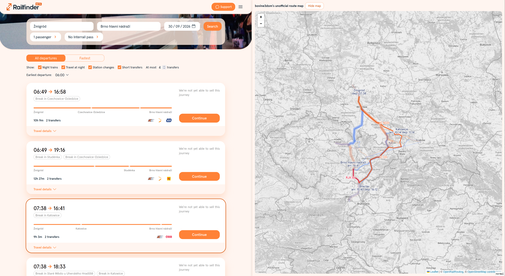

userscripts for railfinder.eu. currently just making maps of routes

# installation

for browsers that support userscripts, if you have e.g. Tampermonkey installed, you can install the script directly by clicking this link: [routemap.user.js](https://raw.githubusercontent.com/bovine3dom/railfinder_hacks/master/src/routemap.user.js)

# todo

- EC grey is hard to read (dunno what do to about this)
